# wpf-propertygrid
Repackaging of Workflow Foundation's property grid for general use in WPF applications

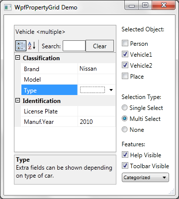 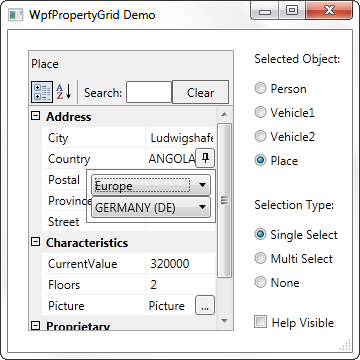

## Disclaimer
The following implementation was originally developed in 2010 and published in CodeProject. After so many years, it seems that it still attracts interest and a few stars, so I decided to move the entire Readme to GitHub.

I no longer maintain the source code or advise on how to implement it. However, I encourage active users to help others in the Issues section.

## Introduction

While working with Windows Workflow Foundation 4.0, I realized that the `PropertyInspectorView` control is a fully-fledged WPF PropertyGrid control, including support for the customization of attributes and custom editors. A PropertyInspectorView is associated with a parent `WorkflowDesigner` object and a sibling workflow `View` object, which is the real drag-and-drop canvas, as shown in this MSDN's screenshot:

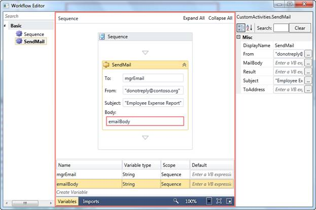
_Workflow Foundation example. Left: Activities Toolbox, Middle: Designer View, Right: Property Inspector._

## Internal Architecture
The overall approach to making the `PropertyInspector` available for general-purpose use is the following:

- Derive a new control from a `Grid` class. The grid will contain the real UI element.
- Incorporate a Workflow Foundation's `WorkflowDesigner` object as a private class member.
- For the designer object, add the corresponding `PropertyInspectorView` as a grid's child. Although it is exposed as a Grid, its real type is `PropertyInspector`.
- Capture some methods of the `PropertyInspector` by using reflection, for further use.
- Implement `SelectedObject` and `SelectedObjects` properties, as in regular PropertyGrid, and handle the change of selection at the `PropertyInspector`.
- Add a `GridSplitter` and a `TextBlock` to mimic the HelpText functionality of the original PropertyGrid.

The following diagram depicts the internal architecture of the WpfPropertyGrid class, as explained in previous lines:

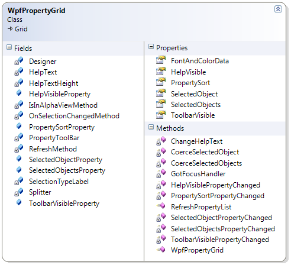

It is needed at least to invoke the public constructor and set the `SelectedObject` or `SelectedObjects`. The `RefreshPropertyList` method will be helpful in refreshing the control when the selected object has been changed externally.

Set the `HelpVisible` property to show the property descriptions at the bottom, while the `ToolbarVisible` will show or hide the upper toolbar. Those properties have the same name as Winform´s PropertyGrid, in order to keep some degree of compatibility.

The same is true for the `PropertySort` property, which accepts a PropertySort enumeration type. It allows to group the properties by categories or show them in a flat fashion.

The `FontAndColorData` property can be used to restyle the control, since it internally sets the `WorkflowDesigner.PropertyInspectorFontAndColorData` property, but little information is available on the Internet.

## Basic Usage - Person Class
The supplied demo project will allow you to test all the `WpfropertyGrid` capabilities. Three classes are defined in DemoClasses.cs, with different features, like custom attributes and editors. Here is the declaration of the first and simplest one:

````csharp
public class Person
{
    public enum Gender { Male, Female }

    #region private fields
    private string[] _Names = new string[3];
    #endregion

    // The following properties are wrapping an array of strings
    #region Public Properties
    [Category("Name")]
    [DisplayName("First Name")]
    public string FirstName
    {
        set { _Names[0] = value; }
        get { return _Names[0]; }
    }

    [Category("Name")]
    [DisplayName("Mid Name")]
    public string MidName
    {
        set { _Names[1] = value; }
        get { return _Names[1]; }
    }

    [Category("Name")]
    [DisplayName("Last Name")]
    public string LastName
    {
        set { _Names[2] = value; }
        get { return _Names[2]; }
    }

    // The following are auto-implemented properties (C# 3.0 and up)
    [Category("Characteristics")]
    [DisplayName("Gender")]
    public Gender PersonGender { get; set; }

    [Category("Characteristics")]
    [DisplayName("Birth Date")]
    public DateTime BirthDate { get; set; }

    [Category("Characteristics")]
    public int Income { get; set; }

    // Other cases of hidden read-only property and formatted property
    [DisplayName("GUID"), ReadOnly(true), Browsable(true)]
    public string GuidStr
    {
        get { return Guid.ToString(); }
    }

    [Browsable(false)]  // this property will not be displayed
    public System.Guid Guid
    {
        get;
        private set;
    }
    #endregion

    public Person()
    {
        // default values
        for (int i = 0; i < 3; i++)
            _Names[i] = "";
        this.PersonGender = Gender.Male;
        this.Guid = System.Guid.NewGuid();
    }

    public override string ToString()
    {
        return string.Format("{0} {1} {2}", FirstName,
            MidName, LastName).Trim().Replace("  ", " ");
    }
}
````

Here is the class diagram and how it appears in the demo application:

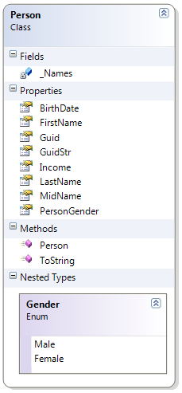 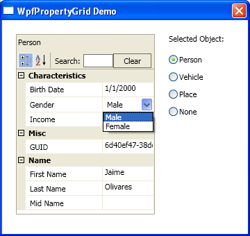

Notice that the control will show just the properties, not the fields. As we are using C# 3.0 or 4.0, we can avoid declaring the underlying fields by using auto-implemented properties, whenever is convenient.

To show the properties of a `Person` object is quite simple; just assign it to the control's `SelectedObject` property, as shown:

````csharp
PropertyGrid1.SelectedObject = thePerson; // typeof(thePerson) == Person
````

## Basic Attributes
In the `Person` class implementation, you will notice some properties that have attributes (those with square brackets); they won't affect your class behavior, but will do with the property grid. These attributes are similar to those implemented in Winforms's `PropertyGrid`. Let's see them in detail.

- `Category`: Lets you specify a category group for the affected property. A category appears by default at the property grid with a gray background, as you can see in the first screenshot. If the property doesn't have a Category attribute, it will belong to a blank category group, as with the GUID property in the previous screenshot. It is recommended to always specify a category for each property.
- `DisplayName`: Will be useful when you want to display a property name that is different from the real one. It is usually used to increase readability with white spaces, or to abbreviate the name.
- `ReadOnly`: When set to `true`, will prevent the property from being edited; it will be just shown in the property grid. To prevent the read-only properties from being hidden, it will necessary to mark them as `Browsable=true`, as with the `GUIDStr` property.
- `Browsable`: When set to `false`, the property will not be shown. It is useful when you have a property you don't want to show, like the GUID property in the first example.

All these attributes are declared in the `System.ComponentModel` namespace and automatically recognized by the property inspector.

## Custom Properties - Vehicle Class

While the simplest implementation of `WpfPropertyGrid` exposes all the properties of a class (except of those with the `Browsable` attribute set to false), the `ICustomProperties` interface will allow some properties to be conditionally exposed. There are some customizations needed to accomplish this, as in the following example:

````csharp
public class Vehicle :
    ICustomTypeDescriptor, INotifyPropertyChanged
{
    public enum CarType { Sedan, StationWagon, Coupe,
        Roadster, Van, Pickup, Truck }
    public enum CarBrand { Acura, Audi, BMW, Citroen,
        Ford, GMC, Honda, Lexus, Mercedes, Mitsubishi,
        Nissan, Porshe, Suzuki, Toyota, VW, Volvo }

    #region Private fields
    private CarType _TypeOfCar;
    #endregion

    #region Public Properties
    [Category("Classification")]
    public CarBrand Brand { get; set; }

    [Category("Classification")]
    [DisplayName("Type")]
    public CarType TypeOfCar
    {
        get { return this._TypeOfCar; }
        set {
            this._TypeOfCar = value;
            NotifyPropertyChanged("TypeOfCar");
        }
    }

    [Category("Classification")]
    public string Model { get; set; }

    [Category("Identification")]
    [DisplayName("Manuf.Year")]
    public int Year { get; set; }

    [Category("Identification")]
    [DisplayName("License Plate")]
    public string Plate { get; set; }

    // Will shown only for Pickup and Truck
    [Category("Capacity")]
    [DisplayName("Volume (ft³)")]
    public int Volume { get; set; }

    [Category("Capacity")]
    [DisplayName("Payload (kg)")]
    public int Payload { get; set; }

    [Category("Capacity")]
    [DisplayName("Crew cab?")]
    public bool CrewCab { get; set; }
    #endregion

    #region ICustomTypeDescriptor Members
    public AttributeCollection GetAttributes() ...
    public string GetClassName() ...
    public string GetComponentName() ...
    public TypeConverter GetConverter() ...
    public EventDescriptor GetDefaultEvent() ...
    public PropertyDescriptor GetDefaultProperty() ...
    public object GetEditor(Type editorBaseType)
    public EventDescriptorCollection
        GetEvents(Attribute[] attributes) ...
    public EventDescriptorCollection GetEvents() ...
    public object
        GetPropertyOwner(PropertyDescriptor pd) ...
    public PropertyDescriptorCollection
        GetProperties(Attribute[] attributes) ...

    // Method implemented to expose Capacity properties
    // conditionally, depending on TypeOfCar
    public PropertyDescriptorCollection GetProperties()
    {
        var props = new PropertyDescriptorCollection(null);

        foreach (PropertyDescriptor prop in
            TypeDescriptor.GetProperties(this, true))
        {
            if (prop.Category=="Capacity" &&
                (this.TypeOfCar != CarType.Pickup &&
                this.TypeOfCar != CarType.Truck))
                continue;
            props.Add(prop);
        }

        return props;
    }
    #endregion

    #region INotifyPropertyChanged Members
    public event PropertyChangedEventHandler PropertyChanged;

    private void NotifyPropertyChanged(String info)
    {
        if (PropertyChanged != null)
            PropertyChanged(this, new PropertyChangedEventArgs(info));
    }
    #endregion
}
````

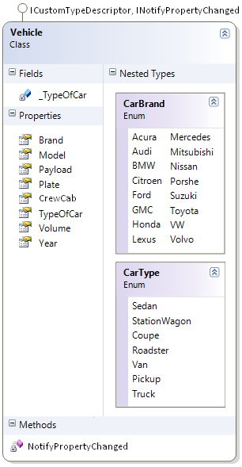 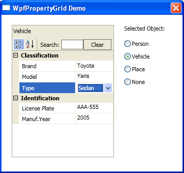 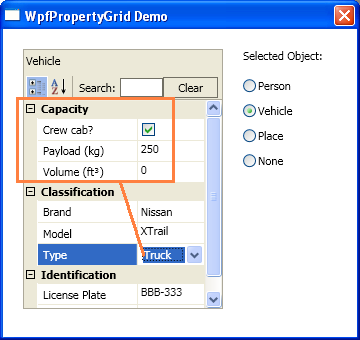

Notice that the most important method  needed to implement the `PropertyGrid.ICustomProperties` interface is `GetProperties()`. This method shall return all the property names you want to expose as an array, depending on some conditions. In this example, if the car type is a _PickUp_ or _Truck_, the `Volume`, `Payload`, and `CrewCab` properties will be exposed.

# Custom Editors - Place Class

> Disclaimer: Although the intent of this article is not to go deep with Editor customization, I will show a couple of examples of the two kinds of editors: extended and dialog-based. The [Workflow Foundation documentation](https://learn.microsoft.com/en-us/dotnet/framework/windows-workflow-foundation/customizing-the-workflow-design-experience) provides more information.

Custom editors are the most powerful feature of this control. There are several tricks you can do with it. By default, the control will provide an editor for all the fundamental classes: `int`, `float`, `double`, etc., and also for strings and enumerations, the latter as a `ComboBox`. If you have a custom class object as a property, it will show the string representation but just as read-only because the grid control doesn't know how to edit it.

The `Place` class implementation shows both. Despite the kind of editor, it must be derived from the `PropertyValueEditor` class, as we will see in detail later.

To specify a custom editor for a property, an `EditorAttribute` attribute must be added to the property declaration, as with `CountryInfo` and `Picture` properties.

````csharp
public class Place
{
    public struct CountryInfo
    {
        public static readonly CountryInfo[] Countries = {
            // African countries
            new CountryInfo(Continent.Africa , "AO", "ANGOLA" ),
            new CountryInfo(Continent.Africa, "CM", "CAMEROON" ),
            // American countries
            new CountryInfo(Continent.America, "MX", "MEXICO" ),
            new CountryInfo(Continent.America, "PE", "PERU" ),
            // Asian countries
            new CountryInfo(Continent.Asia, "JP", "JAPAN" ),
            new CountryInfo(Continent.Asia, "MN", "MONGOLIA" ),
            // European countries
            new CountryInfo(Continent.Europe, "DE", "GERMANY" ),
            new CountryInfo(Continent.Europe, "NL", "NETHERLANDS" ),
            // Oceanian countries
            new CountryInfo(Continent.Oceania, "AU", "AUSTRALIA" ),
            new CountryInfo(Continent.Oceania, "NZ", "NEW ZEALAND" )
        };

        public Continent Contin { get; set; }
        public string Abrev { get; set; }
        public string Name { get; set; }

        public override string ToString()
        {
            return string.Format("{0} ({1})", Name, Abrev);
        }
        public CountryInfo(Continent _continent,
            string _abrev, string _name) : this()
        {
            this.Contin = _continent;
            this.Abrev = _abrev;
            this.Name = _name;
        }
    }

    #region Private fields
    private string[] _Address = new string[4];
    #endregion

    #region Public properties
    [Category("Address")]
    public string Street
    {
        get { return _Address[0]; }
        set { _Address[0] = value; }
    }

    [Category("Address")]
    public string City
    {
        get { return _Address[1]; }
        set { _Address[1] = value; }
    }

    [Category("Address")]
    public string Province
    {
        get { return _Address[2]; }
        set { _Address[2] = value; }
    }

    [Category("Address")]
    public string Postal
    {
        get { return _Address[3]; }
        set { _Address[3] = value; }
    }

    // Custom editor for the following 2 properties
    [Category("Address")]
    [Editor(typeof(CountryEditor), typeof(PropertyValueEditor))]
    public CountryInfo Country { get; set; }

    [Category("Characteristics")]
    [Editor(typeof(PictureEditor), typeof(PropertyValueEditor))]
    public BitmapImage Picture { get; set; }

    [Category("Characteristics")]
    public int Floors { get; set; }

    [Category("Characteristics")]
    public int CurrentValue { get; set; }
    #endregion

    public Place()
    {
        for (int i = 0; i < _Address.Length; i++)
            _Address[i] = string.Empty;
        this.Country = CountryInfo.Countries[0];
    }
}
````

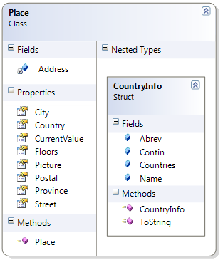  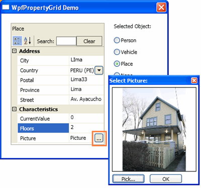

As mentioned, there are two examples of custom editor implementations in the `Place` class; the first one, `CountryEditor`, is an extended editor. It asks for a country with two `ComboBox`es: one for `Continent` and one for `Country`, as shown in the screenshot. To simplify the demonstration, the required XAML `DataTemplate` is placed in the source code file, which is not so usual:

````csharp
class CountryEditor : ExtendedPropertyValueEditor
{
    public CountryEditor()
    {
        // Template for normal view
        string template1 = @"...xaml template here...";

        // Template for extended view. Shown when dropdown button is pressed.
        string template2 = @"...xaml template here...";

        // Load templates
        using (var sr = new MemoryStream(Encoding.UTF8.GetBytes(template1)))
        {
            this.InlineEditorTemplate = XamlReader.Load(sr) as DataTemplate;
        }
        using (var sr = new MemoryStream(Encoding.UTF8.GetBytes(template2)))
        {
            this.ExtendedEditorTemplate = XamlReader.Load(sr) as DataTemplate;
        }
    }
}
````

For an extended editor, it has to be derived from `ExtendedPropertyValueEditor` class. That will allow the property grid to drop down a customized control to input the property data.

The constructor should load both templates, the normal one and the extended one, from some XAML `DataTemplate` declarations. Usually those templates are placed in a XAML Resource file.

The second example of a custom editor is `PictureEditor`; it is different from an extended editor because it shows a new dialog when the dropdown button is pressed, so it will require implementing that window separately. Also, it is derived from a different base class: `DialogPropertyValueEditor`. The sample class is shown partially for abbreviation purposes:

````csharp
class PictureEditor : DialogPropertyValueEditor
{
    // Window to show the current image and optionally pick a different one
    public class ImagePickerWindow : Window
    {
        // regular window implementation here
    }

    public PictureEditor()
    {
        string template = @"...xmal template here...";

        using (var sr = new MemoryStream(Encoding.UTF8.GetBytes(template)))
        {
            this.InlineEditorTemplate = XamlReader.Load(sr) as DataTemplate;
        }
    }

    // Open the dialog to pick image, when the dropdown button is pressed
    public override void ShowDialog(PropertyValue propertyValue, IInputElement commandSource)
    {
        ImagePickerWindow window = new ImagePickerWindow(propertyValue.Value as BitmapImage);
        if (window.ShowDialog().Equals(true))
        {
            var ownerActivityConverter = new ModelPropertyEntryToOwnerActivityConverter();
            ModelItem activityItem = ownerActivityConverter.Convert(propertyValue.ParentProperty,
                typeof(ModelItem), false, null) as ModelItem;
            using (ModelEditingScope editingScope = activityItem.BeginEdit())
            {
                propertyValue.Value = window.TheImage;
                editingScope.Complete(); // commit the changes
            }
        }
    }
}
````

## Multiple selection

While single selection can be done by setting the `SelectedObject` property to any value, multiple selection is achieved by setting the `SelectedObjects` property.

When multiple objects are selected, the Type Label at the top of the control will show the word "&lt;multiple&gt;" to the right of the type. If all the selected objects are  the same type, the type name is shown (see screenshot below). Otherwise, the type _"Object"_ is displayed.

All the properties that have the same type and name for all the selected objects are shown, even if the selected objects are not of the same type. Try using Person and Place in the Demo application, which shares the FirstName and LastName properties.


## Help text
The textbox at the bottom of the control is called the HelpText. It will shown a property description set with the `DescriptionAttribute` attribute (see screenshot above).

When multiple selected objects are present, the description will be shown only if all the selected objects are of the same type.

The HelpText box can be shown or hidden by setting the `HelpVisible` property in the `PropertyGrid`.

## How to use it

The WpfPropertyGrid can be embedded directly into your application. It doesn't need to be compiled in a separate DLL. To include it in some XAML declaration, you have to specify the correct namespace (a local `System.Windows.Control`) and add the corresponding tag to your WPF window or dialog:

````xml
<Window Title="WpfPropertyGrid Demo" x:class="WpfPropertyGrid_Demo.MainWindow"
    xmlns="http://schemas.microsoft.com/winfx/2006/xaml/presentation"
    xmlns:x="http://schemas.microsoft.com/winfx/2006/xaml" 
    xmlns:wpg="clr-namespace:System.Windows.Control" 
    Width="360" Resizemode="NoResize" Height="340">
    <Grid VerticalAlignment="Stretch" HorizontalAlignment="Stretch">

        <wpg:WpfPropertyGrid x:Name="PropertyGrid1" Width="200" Height="260" />

    </Grid>
</window>
`````

### Dependency Properties

As the control properties are _Dependency Properties_, they can be bound to other elements in the container dialog or window like in the demo application (simplified):

````xml
<Window x:Class="WpfPropertyGrid_Demo.MainWindow"
   xmlns=http://schemas.microsoft.com/winfx/2006/xaml/presentation
   xmlns:x="http://schemas.microsoft.com/winfx/2006/xaml"
   xmlns:sys="clr-namespace:System;assembly=mscorlib"
   xmlns:wpg="clr-namespace:System.Windows.Controls"
   Title="WpfPropertyGrid Demo" mc:Ignorable="d" ResizeMode="CanResizeWithGrip" 
   Width="360" Height="360" MinWidth="360" MinHeight="400">

   <wpg:WpfPropertyGrid x:Name="PropertyGrid1" 
      Margin="20,20,118,21" HorizontalAlignment="Stretch" VerticalAlignment="Stretch" 
      HelpVisible="{Binding ElementName=ShowDescrip, Path=IsChecked}" 
      ToolbarVisible="{Binding ElementName=ShowToolbar, Path=IsChecked}"
      PropertySort="{Binding ElementName=ComboSort, Path=SelectedItem}" />
````

The demo application has been built with Visual Studio 2010. As the WPF property inspector is a new feature in .net 4.0, this implementation won't be available for applications written for .net 3.0 or 3.5, even when they implement Workflow Foundation.

To use this control, you just need to add the WpfPropertyGrid.cs file to your project. Some references will be required in your solution:

- System.Activities
- System.Activities.Core.Presentation
- System.Activities.Presentation

